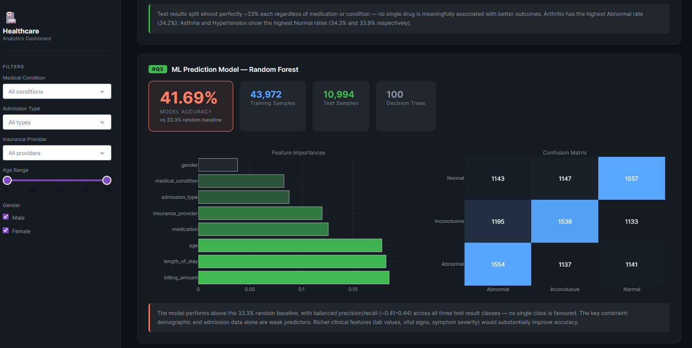

# Healthcare admissions and billing analysis

**Question:** How do admissions, length of stay, billing and test-result labels vary across this healthcare practice dataset?

This Python capstone examines **55,500 rows and 15 variables** from the [Prasad Patil healthcare dataset on Kaggle](https://www.kaggle.com/datasets/prasad22/healthcare-dataset). This is a public practice dataset, not a hospital's verified operational record. The repository includes the CSV, an analysis notebook, dashboard images, a report and a presentation.

## Analysis

The [`healthcare_analysis.ipynb`](healthcare_analysis.ipynb) notebook explores admission types and conditions, length of stay, billing by condition and insurer, medication versus test-result labels, and a Random Forest classification exercise. It reports similar numbers of records across six conditions, a roughly 15.5-day average stay and average billing around $25,500. The model reports **41.69% accuracy**, which should be interpreted against class distribution and validation design, not described as clinically useful on its own.

## Interpretation and limits

These comparisons describe the dataset; they do not show that particular treatments or insurers cause outcomes. The dataset's artificial-looking category balance limits real-world conclusions, and patient-level prediction would require appropriate clinical validation. No runnable Dash app or `requirements.txt` is present in this repository, so the screenshots are previews of the analysis rather than a locally launchable application.

## Files

| File | Purpose |
| --- | --- |
| [`healthcare_dataset.csv`](healthcare_dataset.csv) | Practice dataset |
| [`healthcare_analysis.ipynb`](healthcare_analysis.ipynb) | Python notebook |
| [`images/`](images/) | Three dashboard screenshots |
| [`Healthcare_Analysis_Report.docx`](archive/Healthcare_Analysis_Report.docx) | Written report |
| [`Healthcare_Analysis_Presentation_1.pptx`](archive/Healthcare_Analysis_Presentation_1.pptx) | Presentation |

Open the notebook in Jupyter or VS Code. Install the packages it imports in your Python environment; package versions are not pinned here.

**Analyst:** [Chukwuemeka Ogo](https://mikkymo.github.io/portfolio/) · [LinkedIn](https://www.linkedin.com/in/ogochukwuemeka/)
